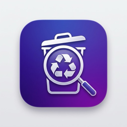
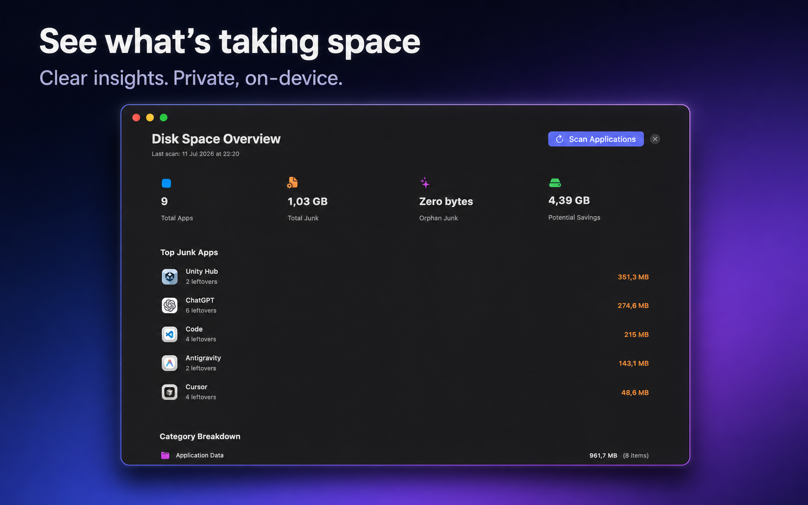
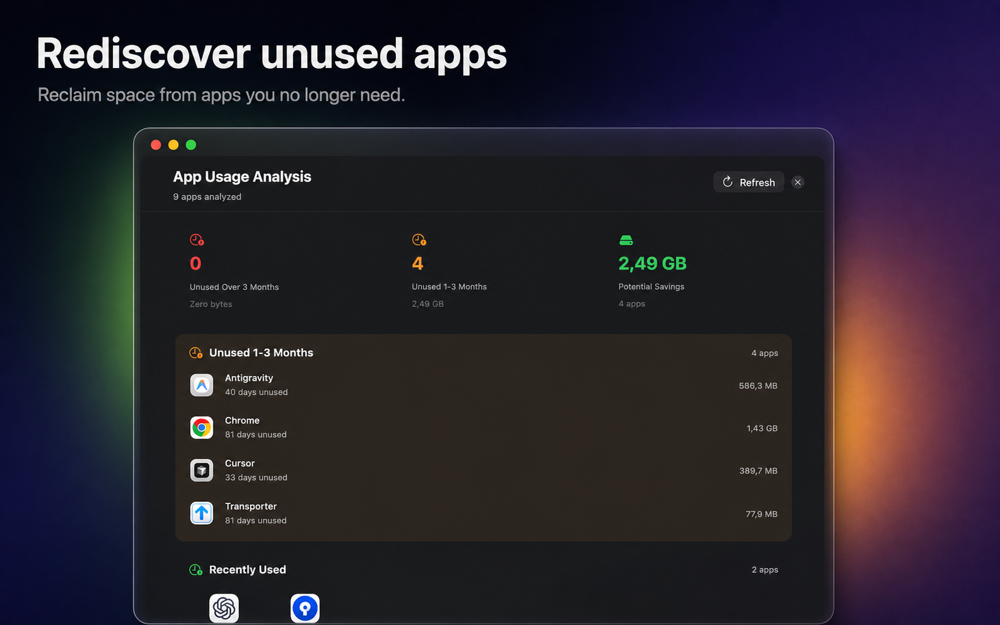

<p align="center">
  
</p>

<h1 align="center">ApexUninstaller</h1>

<p align="center">
  A private, open-source macOS uninstaller that finds related leftovers and lets you review everything before moving it to Trash.
</p>

<p align="center">
  <a href="https://github.com/dangvanhai13091989/ApexUninstaller/releases/latest"></a>
  <a href="https://github.com/dangvanhai13091989/ApexUninstaller/actions/workflows/ci.yml"></a>
  <a href="https://github.com/dangvanhai13091989/ApexUninstaller/releases"></a>
  
  <a href="LICENSE"></a>
</p>

<p align="center">
  <strong><a href="https://github.com/dangvanhai13091989/ApexUninstaller/releases/latest">Download the signed app</a></strong>
  · <a href="#mac-app-store-edition">Mac App Store edition</a>
  · <a href="#build-from-source">Build from source</a>
  · <a href="https://paypal.me/HaiDang880">Support development</a>
</p>


## Why ApexUninstaller?

| Thorough cleanup | Safety first | Private by design |
| --- | --- | --- |
| Finds caches, preferences, containers, logs and launch agents related to an app. | Shows every path, leaves uncertain items unselected and blocks protected locations. | Scanning stays on your Mac. No account, analytics, tracking or data upload. |

## Download

Choose the edition that suits your workflow. Both are universal apps for macOS 14 Sonoma or later and work on Apple Silicon and Intel Macs.

### ApexUninstaller Direct — free

[**Download the latest signed and notarized release →**](https://github.com/dangvanhai13091989/ApexUninstaller/releases/latest)

`ApexUninstaller Direct.app` is signed with a Developer ID certificate and notarized by Apple. It is the full, free edition with direct `~/Library` scanning; it never runs as root and never enables Full Disk Access itself.

### Mac App Store edition

The paid Mac App Store edition is sandboxed, reviewed by Apple, and updated only through the Mac App Store. It has reduced scan coverage by design and asks you to select `~/Library` once before scanning it.

The public App Store link will be added here as soon as Apple has approved the listing. Until then, please use the signed Direct release or build from source.

## Direct edition and Mac App Store edition

| Capability | Direct | Mac App Store |
| --- | --- | --- |
| App Sandbox | Disabled | Required |
| Scan `~/Library` | Direct access | User selects the folder once |
| Full Disk Access | Optional, user-controlled | Not requested |
| Updates | GitHub Releases | Mac App Store |

Full Disk Access is never enabled automatically. macOS requires the user to grant it in System Settings, and ApexUninstaller continues to work with reduced coverage without it.

The two editions have separate bundle identifiers and app names, so new releases can be installed side by side. Direct 1.0.1 used the old shared app identity; install the new `ApexUninstaller Direct.app` alongside it, confirm your settings, then remove the old copy if you no longer need it.

## Highlights

<table>
  <tr>
    <td width="50%"></td>
    <td width="50%"></td>
  </tr>
  <tr>
    <td><strong>See what's taking space</strong><br>Understand application leftovers, junk categories and potential savings at a glance.</td>
    <td><strong>Rediscover unused apps</strong><br>Find applications you may no longer need without sending usage information anywhere.</td>
  </tr>
</table>

## Everything you need

- **Complete uninstall:** find application caches, preferences, containers, logs and launch agents.
- **Confidence labels:** understand which matches are Safe, Likely or need Review.
- **Reset app data:** start fresh without removing the application itself.
- **Storage tools:** find orphaned leftovers, duplicate files and large files.
- **System junk:** review user caches, logs and Xcode Derived Data.
- **Clipboard history:** opt in to an encrypted, local-only 24-hour history of copied text, links, and images up to 8 MB; open it with a configurable global shortcut and paste manually into the app you were using.
- **Batch workflow:** scan and remove multiple applications efficiently.
- **Drag and drop:** drop an `.app` onto ApexUninstaller to inspect it immediately.
- **Custom locations:** include game libraries, external drives or other folders.
- **Recoverable removal:** move selected items to Trash instead of permanently deleting them.
- **Eight languages:** English, Vietnamese, Japanese, Korean, Chinese, French, German and Spanish.

## Safety

ApexUninstaller shows the paths it finds and leaves `Review` items unselected by default. Destructive filesystem roots, protected system locations and the currently running app bundle are blocked by an additional removal safety policy.

Review every selected path before confirming a cleanup. Even recoverable Trash operations can disrupt another app if its data was selected incorrectly.

Security issues should be reported privately as described in [SECURITY.md](SECURITY.md).

## Build from source

Requirements:

- macOS 14 or later
- Xcode 15 or later
- [XcodeGen](https://github.com/yonaskolb/XcodeGen)

Generate the project and run the Direct build:

```bash
xcodegen generate
open ApexUninstaller.xcodeproj
```

Select the `ApexUninstaller-Direct` scheme. The standard `ApexUninstaller` scheme remains the sandboxed Mac App Store build.

For a Mac App Store archive, select the standard `ApexUninstaller` scheme and archive it with the `Release` configuration. See [the App Store release guide](docs/APP_STORE_RELEASE.md) for the required versioning, validation, upload, and review steps.

Command-line tests:

```bash
xcodebuild test \
  -project ApexUninstaller.xcodeproj \
  -scheme ApexUninstaller-Direct \
  -destination 'platform=macOS'
```

Maintainers can create a signed and notarized archive with `scripts/release-direct.sh`. The script uses `NOTARY_KEYCHAIN_PROFILE` when provided, or the Apple account signed in to Xcode. Signing credentials are read from the macOS Keychain and are never stored in this repository.

## Contributing

Issues and pull requests are welcome. Please read [CONTRIBUTING.md](CONTRIBUTING.md) first. By contributing, you agree that your contribution is licensed under GPL-3.0-or-later.

## Support development

ApexUninstaller is free software and every feature remains available without payment. If it saves you time, you can support continued maintenance, signing and notarization through PayPal.

[](https://paypal.me/HaiDang880)

Sponsorship is always optional and never unlocks features. See [SUPPORT.md](SUPPORT.md) for what donations fund, free ways to help, and how to avoid unofficial payment requests.

## License and name

Source code is licensed under [GPL-3.0-or-later](LICENSE). The license does not grant permission to use the ApexUninstaller name, logo or other brand assets for a redistributed modified build; see [TRADEMARKS.md](TRADEMARKS.md).

---

## Tiếng Việt

ApexUninstaller là ứng dụng gỡ cài đặt macOS miễn phí và mã nguồn mở. Bản Direct không dùng App Sandbox nên có thể quét `~/Library` trực tiếp, nhưng không chạy bằng quyền root và không tự bật Full Disk Access. Mọi mục được chọn vẫn được chuyển vào Thùng rác để có thể khôi phục.

[Tải bản Direct miễn phí](https://github.com/dangvanhai13091989/ApexUninstaller/releases/latest) · [Bản Mac App Store](#mac-app-store-edition) · [Ủng hộ qua PayPal](https://paypal.me/HaiDang880)
