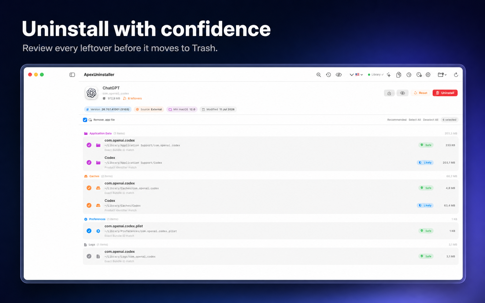

# ApexUninstaller

A lightweight, private macOS app uninstaller that finds related leftovers before moving selected items to Trash.



## Download

The recommended build is **ApexUninstaller Direct** for macOS 14 Sonoma or later.

[Download the latest signed and notarized release](https://github.com/dangvanhai13091989/ApexUninstaller/releases/latest)

Move `ApexUninstaller.app` to `/Applications`, then open it normally. The release is signed with a Developer ID certificate and notarized by Apple.

## Direct edition and Mac App Store edition

| Capability | Direct | Mac App Store |
| --- | --- | --- |
| App Sandbox | Disabled | Required |
| Scan `~/Library` | Direct access | User selects the folder once |
| Full Disk Access | Optional, user-controlled | Not requested |
| Updates | GitHub Releases | Mac App Store |

Full Disk Access is never enabled automatically. macOS requires the user to grant it in System Settings, and ApexUninstaller continues to work with reduced coverage without it.

## Features

- Find application caches, preferences, containers, logs and launch agents.
- Confidence labels: Safe, Likely and Review.
- Reset app data without removing the application.
- Find orphaned leftovers, duplicate files and large files.
- Clean user caches, logs and Xcode Derived Data.
- Move items to Trash instead of permanently deleting them.
- Keep all scanning on-device with no account or analytics.
- Localized in English, Vietnamese, Japanese, Korean, Chinese, French, German and Spanish.

## Safety

ApexUninstaller shows the paths it finds and leaves `Review` items unselected by default. Destructive filesystem roots, protected system locations and the currently running app bundle are blocked by an additional removal safety policy.

Review every selected path before confirming a cleanup. Even recoverable Trash operations can disrupt another app if its data was selected incorrectly.

Security issues should be reported privately as described in [SECURITY.md](SECURITY.md).

## Build from source

Requirements:

- macOS 14 or later
- Xcode 15 or later
- [XcodeGen](https://github.com/yonaskolb/XcodeGen)

Generate the project and run the Direct build:

```bash
xcodegen generate
open ApexUninstaller.xcodeproj
```

Select the `ApexUninstaller-Direct` scheme. The standard `ApexUninstaller` scheme remains the sandboxed Mac App Store build.

Command-line tests:

```bash
xcodebuild test \
  -project ApexUninstaller.xcodeproj \
  -scheme ApexUninstaller-Direct \
  -destination 'platform=macOS'
```

Maintainers can create a signed and notarized archive with `scripts/release-direct.sh`. The script uses `NOTARY_KEYCHAIN_PROFILE` when provided, or the Apple account signed in to Xcode. Signing credentials are read from the macOS Keychain and are never stored in this repository.

## Contributing

Issues and pull requests are welcome. Please read [CONTRIBUTING.md](CONTRIBUTING.md) first. By contributing, you agree that your contribution is licensed under GPL-3.0-or-later.

## Support development

ApexUninstaller is free software. GitHub Sponsors onboarding is pending; the donation link will be enabled here after GitHub approves the maintainer profile. Until then, starring and sharing the project is the best way to support development. Sponsorship will always be optional and will not unlock features.

## License and name

Source code is licensed under [GPL-3.0-or-later](LICENSE). The license does not grant permission to use the ApexUninstaller name, logo or other brand assets for a redistributed modified build; see [TRADEMARKS.md](TRADEMARKS.md).

---

## Tiếng Việt

ApexUninstaller là ứng dụng gỡ cài đặt macOS mã nguồn mở. Bản Direct không dùng App Sandbox nên có thể quét `~/Library` trực tiếp, nhưng không chạy bằng quyền root và không tự bật Full Disk Access. Mọi mục được chọn vẫn được chuyển vào Thùng rác để có thể khôi phục.
